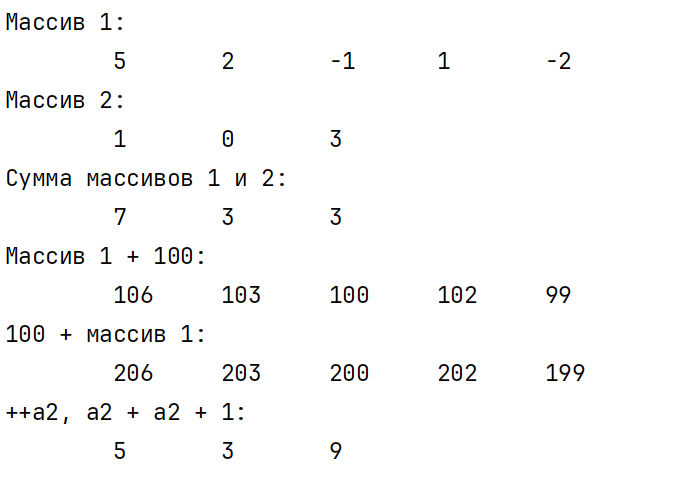
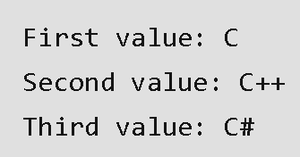

**Цель занятия:** изучить способы определения операций в классе.

## Теоретический материал

### Операции класса

C# позволяет переопределить действие большинства операций так, чтобы при использовании с объектами конкретного класса они выполняли заданные функции. Это дает возможность применять экземпляры собственных типов данных в составе выражений таким же образом, как стандартных, например:

```
MyObject а, Ь, с; 
с = а + Ь; 
// используется операция сложения для класса MyObject
```

Определение собственных операций класса часто называют *перегрузкой операций.* Перегрузка обычно применяется для классов, описывающих математические или физические понятия, то есть таких классов, для которых семантика операций делает программу более понятной. Если назначение операции интуитивно не понятно с первого взгляда, перегружать такую операцию не рекомендуется. Операции класса описываются с помощью методов специального вида *(функций-операций)*. Перегрузка операций похожа на перегрузку обычных методов. Синтаксис операции:

`[ атрибуты ] спецификаторы объявитель_операции тело`

*Атрибуты* рассматриваются позже, в качестве спецификаторов одновременно используются ключевые слова `public` и `static`. Кроме того, операцию можно объявить как внешнюю (`extern`).

*Объявитель* операции содержит ключевое слово `operator`, по которому и опознается описание операции в классе. *Тело* операции определяет действия, которые выполняются при использовании операции в выражении. Тело представляет собой блок, аналогичный телу других методов.

*Объявитель операции* содержит ключевое слово `operator`, по которому и опознается описание операции в классе. Тело операции определяет действия, которые выполняются при использовании операции в выражении. Тело представляет собой блок, аналогичный телу других методов.

Новые обозначения для собственных операций вводить нельзя. Для операций класса сохраняются количество аргументов, приоритеты операций и правила ассоциации (справа налево или слева направо), используемые в стандартных типах данных.

При описании операций необходимо соблюдать следующие правила:

-  операция должна быть описана как открытый статический метод класса (спецификаторы `public static`);

-  параметры в операцию должны передаваться по значению (то есть не должны предваряться ключевыми словами `ref` или `out`);

-  сигнатуры всех операций класса должны различаться;

-  типы, используемые в операции, должны иметь не меньшие права доступа, чем сама операция (то есть должны быть доступны при использовании операции).

В С# существуют три вида операций класса: унарные, бинарные и операции преобразования типа.

### **Унарные операции**

Можно определять в классе следующие унарные операции:\
`+` `-` `!` `~` `++` `--` `true` `false`

Синтаксис объявителя унарной операции:\
`тип operator унарная_операция ( параметр )`

Примеры заголовков унарных операций:

```
public static int operator+ ( MyObject m )
public static MyObject operator-- ( MyObject m )
public static bool operator true ( MyObject m )
```

Параметр, передаваемый в операцию, должен иметь тип класса, для которого она определяется. Операция должна возвращать:

-  для операций `+`, `-`, `!` и `~` -- величину любого типа;

-  для операций `++` и `--` -- величину типа класса, для которого она определяется;

-  для операций `true` и `false` -- величину типа `bool`.

:::tip 

Операции не должны изменять значение передаваемого им операнда. Операция, возвращающая величину типа класса, для которого она определяется, должна создать новый объект этого класса, выполнить с ним необходимые действия и передать его в качестве результата.

:::

Префиксный и постфиксный инкременты не различаются (для них может существовать только одна реализация, которая вызывается в обоих случаях).

Операции `true` и `false` обычно определяются для логических типов SQL, обладающих неопределенным состоянием, и не входят в число тем, рассматриваемых здесь.

#### **Листинг 1 – Определение операции инкремента для класса** `SafeArray`

```
using System;

namespace ConsoleApplication1
{
    class SafeArray
    {
        public SafeArray(int size)  // конструктор
        {
            a = new int[size];
            length = size;
        }

        public SafeArray(params int[] arr)  // новый конструктор
        {
            length = arr.Length;
            a = new int[length];
            for (int i = 0; i < length; ++i) a[i] = arr[i];
        }

        public static SafeArray operator++(SafeArray x) // операция ++
        {
            SafeArray temp = new SafeArray(x.length);
            for (int i = 0; i < x.length; ++i)
                temp[i] = ++x.a[i];
            return temp;
        }

        public int LengthArray // свойство, возвращающее размерность
        {
            get { return a.Length; }
        }

        public int this[int i]  // индексатор
        {
            get
            {
                if (i >= 0 && i < length)
                    return a[i];
                else
                    throw new IndexOutOfRangeException(); // исключение
            }
            set
            {
                if (i >= 0 && i < length)
                    a[i] = value;
                else
                    throw new IndexOutOfRangeException(); // исключение
            }
        }

        // Метод – выводит поле-массив на экран
        public void Print(string name)
        {
            Console.WriteLine(name + ":");
            for (int i = 0; i < a.Length; i++)
                Console.Write(a[i] + " ");
            Console.WriteLine();
        }

        int[] a;
        int length;
    }

    class Class1
    {
        static void Main()
        {
            try
            {
                SafeArray a1 = new SafeArray(5, 2, -1, 1, -2);
                a1.Print("Массив 1");
                a1++;
                a1.Print("Инкремент массива 1");
            }
            catch (Exception e) // обработка исключения
            {
                Console.WriteLine(e.Message);
            }
        }
    }
}
```

### **Бинарные операции**

Можно определять в классе следующие бинарные операции:\
`+` `-` `*` `/` `%` `&` `|` `^` `<<` `>>` `==` `!=` `>` `<` `>=` `<=`

Синтаксис объявителя бинарной операции:\
`тип operator бинарная_операция (параметр1, параметр2)`

Примеры заголовков бинарных операций:

```
public static MyObject operator + (MyObject m1, MyObject m2)
public static bool operator == (MyObject m1, MyObject m2)
```

:::tip 

Хотя бы один параметр, передаваемый в операцию, должен иметь тип класса, для которого она определяется. Операция может возвращать величину любого типа.

:::

Операции `==` и `!=`, `>` и `<`, `>=` и `<=` определяются только парами и обычно возвращают логическое значение. Чаще всего в классе определяют операции сравнения на равенство и неравенство для того, чтобы обеспечить сравнение объектов, а не их ссылок, как определено по умолчанию для ссылочных типов.

#### **Листинг 2 -- Определение операции сложения для класса** `SafeArray`

```
using System;

namespace ConsoleApplication1
{
    class SafeArray
    {
        public SafeArray(int size)
        {
            a = new int[size];
            length = size;
        }

        public SafeArray(params int[] arr)
        {
            length = arr.Length;
            a = new int[length];
            for (int i = 0; i < length; ++i) a[i] = arr[i];
        }

        public static SafeArray operator + (SafeArray x, SafeArray y) // +
        {
            int len = x.length < y.length ? x.length : y.length;
            SafeArray temp = new SafeArray(len);

            for (int i = 0; i < len; ++i)
                temp[i] = x[i] + y[i];
            return temp;
        }

        public static SafeArray operator + (SafeArray x, int y) // +
        {
            SafeArray temp = new SafeArray(x.length);
            for (int i = 0; i < x.length; ++i)
                temp[i] = x[i] + y;
            return temp;
        }

        public static SafeArray operator + (int x, SafeArray y) // +
        {
            SafeArray temp = new SafeArray(y.length);
            for (int i = 0; i < y.length; ++i)
                temp[i] = x + y[i];
            return temp;
        }

        public static SafeArray operator ++ (SafeArray x) // ++
        {
            SafeArray temp = new SafeArray(x.length);
            for (int i = 0; i < x.length; ++i)
                temp[i] = ++x.a[i];
            return temp;
        }

        public int this[int i] // [ ]
        {
            get
            {
                if (i >= 0 && i < length)
                    return a[i];
                else
                    throw new IndexOutOfRangeException();
            }
            set
            {
                if (i >= 0 && i < length)
                    a[i] = value;
                else
                    throw new IndexOutOfRangeException();
            }
        }

        public void Print(string name)
        {
            Console.WriteLine(name + ":");
            for (int i = 0; i < length; ++i)
                Console.Write("\t" + a[i]);
            Console.WriteLine();
        }

        int[] a;
        int length;
    }

    class Class1
    {
        static void Main()
        {
            try
            {
                SafeArray a1 = new SafeArray(5, 2, -1, 1, -2);
                a1.Print("Массив 1");

                SafeArray a2 = new SafeArray(1, 0, 3);
                a2.Print("Массив 2");
                a1++;
                SafeArray a3 = a1 + a2;
                a3.Print("Сумма массивов 1 и 2");

                a1 = a1 + 100;  // 1
                a1.Print("Массив 1 + 100");

                a1 = 100 + a1;  // 2
                a1.Print("100 + массив 1");

                a2 += ++a2 + 1; // 3 оторвать руки!
                a2.Print("++a2, a2 + a2 + 1");
            }
            catch (Exception e)
            {
                Console.WriteLine(e.Message);
            }
        }
    }
}
```

**Результат работы программы:**

{width=697px height=477px}

:::info 

Обратите внимание: чтобы обеспечить возможность сложения с константой, операция сложения перегружена два раза для случаев, когда константа является первым и вторым операндом (операторы 2 и 1).

:::

Сложную операцию присваивания `+=` (оператор 3) определять не требуется, да это и невозможно. При ее выполнении автоматически вызываются сначала операция сложения, а потом присваивания. В целом же оператор 3 демонстрирует недопустимую манеру программирования, поскольку результат его выполнения неочевиден.

:::tip 

В перегруженных методах для объектов применяется индексатор. Для повышения эффективности можно обратиться к закрытому полю-массиву и непосредственно, например:\
`temp.a[i] = x + y.a[i];`

:::

### **Операции преобразования типа**

Операции преобразования типа обеспечивают возможность явного и неявного преобразования между пользовательскими типами данных. Синтаксис объявителя операции преобразования типа:

```
implicit operator тип ( параметр )   // неявное преобразование
explicit operator тип ( параметр )   // явное преобразование
```

Эти операции выполняют преобразование из типа параметра в тип, указанный в заголовке операции. Одним из этих типов должен быть класс, для которого определяется операция. Таким образом, операции выполняют преобразование либо типа класса к другому типу, либо наоборот. Преобразуемые типы не должны быть связаны отношениями наследования.

Примеры операций преобразования типа для класса `Monster`:

```
public static implicit operator int(Monster m)
{
    return m.health;
}

public static explicit operator Monster(int h)
{
    return new Monster(h, 100, "Fromlnt");
}
```

Ниже приведены примеры использования этих преобразований в программе. Не надо искать в них смысл, они просто иллюстрируют синтаксис:

```
Monster Masha = new Monster(200, 200, "Masha");
int i = Masha;           // неявное преобразование
Masha = (Monster)500;    // явное преобразование
```

Неявное преобразование выполняется автоматически:

-  при присваивании объекта переменной целевого типа, как в примере;

-  при использовании объекта в выражении, содержащем переменные целевого типа;

-  при передаче объекта в метод на место параметра целевого типа;

-  при явном приведении типа.

*Явное преобразование* выполняется при использовании операции приведения типа.

Все операции класса должны иметь разные сигнатуры. В отличие от других видов методов, для операций преобразования тип возвращаемого значения включается в сигнатуру, иначе нельзя было бы определять варианты преобразования данного типа в несколько других. Ключевые слова `implicit` и `explicit` в сигнатуру не включаются, следовательно, для одного и того же преобразования нельзя определить одновременно явную и неявную версии.

*Неявное преобразование* следует определять так, чтобы при его выполнении не возникала потеря точности и не генерировались исключения. Если эти ситуации возможны, преобразование следует описать как явное.

### Индексаторы

Индексаторы позволяют индексировать объекты и обращаться к данным по индексу. Фактически с помощью индексаторов мы можем работать с объектами как с массивами. По форме они напоминают свойства со стандартными блоками `get` и `set`, которые возвращают и присваивают значение.

Формальное определение индексатора:

```
возвращаемый_тип this [Тип параметр1, ...]
{
    get { ... }
    set { ... }
}
```

В отличие от свойств индексатор не имеет названия. Вместо него указывается ключевое слово this, после которого в квадратных скобках идут параметры. **Индексатор должен иметь как минимум один параметр.**

### Основное различие между индексаторами и свойствами:

-  Метод доступа к свойству (get/set) не принимает параметров.

-  Метод доступа к индексу (get/set) должен принимать хотя бы один параметр.

### Пример: Простой индексатор

```
using System;

class Geeks
{
    private string[] values = new string[3];

    // Indexer declaration
    public string this[int index]
    {
        get
        {
            return values[index];
        }
        set
        {
            values[index] = value;
        }
    }
}

class Program
{
    static void Main()
    {
        Geeks obj = new Geeks();

        obj[0] = "C";
        obj[1] = "C++";
        obj[2] = "C#";

        Console.WriteLine("First Value: " + obj[0]);
        Console.WriteLine("Second Value: " + obj[1]);
        Console.WriteLine("Third Value: " + obj[2]);
    }
}
```

{width=335px height=176px}

<https://metanit.com/sharp/tutorial/4.10.php>

## Требования к отчету

**Структура отчета:**

1. **Титульный лист**

2. **Цель работы**

3. **Условие задания**

4. **Код программы**

5. **Скриншоты тестирования программы**

6. **Вывод по цели работы**

## Примечания

**Оценка 5 :**

-  Выполнены общие требования заданий 1 и 2

-  Реализован индивидуальный вариант для каждого задания

**Оценка 4 :**

-  Выполнено полностью задание 1 ИЛИ задание 2

-  Из другого задания выполнена общая часть (базовые требования)

**Оценка 3 :**

-  Выполнено полностью любое одно задание (1 ИЛИ 2)

-  ИЛИ выполнена только общая часть каждого из двух заданий


