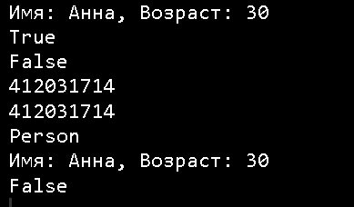

**Цель работы:** изучить возможности наследования классов.

## Теоретический материал

### Наследование

*Наследование (inheritance)* является одним из ключевых моментов ООП. Благодаря наследованию один класс может унаследовать функциональность другого класса. Пусть у нас есть следующий класс Person, который описывает отдельного человека:

```
class Person
{
private string _name;
public string Name
{
get { return _name; }
set { _name = value; }
}
public void Display()
{
Console.WriteLine(Name);
}
} 
```

Но вдруг нам потребовался класс, описывающий сотрудника предприятия - класс Employee. Поскольку этот класс будет реализовывать тот же функционал, что и класс Person, так как сотрудник - это также и человек, то было бы ***рационально сделать класс Employee производным (или наследником, или подклассом) от класса Person, который, в свою очередь, называется базовым классом или родителем (или суперклассом)***:

```
class Employee : Person
{
} 
```

После двоеточия мы указываем базовый класс для данного класса. Для класса Employee базовым является Person, и поэтому класс Employee наследует все те же свойства, методы, поля, которые есть в классе Person.

:::note 

Единственное, что не передается при наследовании, это конструкторы базового класса.

:::

Таким образом, наследование реализует отношение is-a (является), объект класса Employee также является объектом класса Person:

```
static void Main(string[] args)
{
Person p = new Person { Name = "Tom"};
p.Display();
p = new Employee { Name = "Sam" };
p.Display();
Console.Read();
} 
```

И поскольку объект Employee является также и объектом Person, то мы можем так определить переменную:

`Person p = new Employee()`

По умолчанию все классы наследуются от базового класса Object, даже если мы явным образом не устанавливаем наследование.

:::tip 

Поэтому выше определенные классы Person и Employee кроме своих собственных методов, также будут иметь и методы класса Object: ToString(), Equals(), GetHashCode() и GetType().

:::

{width=1024px height=768px}

Все классы по умолчанию могут наследоваться. Однако здесь есть ряд ограничений:

1. Не поддерживается множественное наследование, класс может наследоваться только от одного класса.

2. При создании производного класса надо учитывать тип доступа к базовому классу

3. Тип доступа к производному классу должен быть таким же, как и у базового класса, или более строгим.

То есть, если базовый класс у нас имеет тип доступа **internal**, то производный класс может иметь тип доступа **internal** или **private**, но не **public**. *Однако следует также учитывать, что если базовый и производный класс находятся в разных сборках (проектах), то в этом случае производный класс может наследовать только от класса, который имеет модификатор public.* Если класс объявлен с модификатором **sealed**, то от этого класса нельзя наследовать и создавать производные классы. Например, следующий класс не допускает создание наследников:

`sealed class Admin { }`

:::note 

Нельзя унаследовать класс от статического класса.

:::

### Доступ к членам базового класса из класса-наследника

Вернемся к нашим классам Person и Employee. Хотя Employee наследует весь функционал от класса Person, посмотрим, что будет в следующем случае:

```
class Employee : Person
 {
 public void Display()
 {
 Console.WriteLine(_name);
 }
 } 
```

Этот код не сработает и выдаст ошибку, так как переменная \_name объявлена с модификатором private и поэтому к ней доступ имеет только класс Person. Но зато в классе Person определено общедоступное свойство Name, которое мы можем использовать, поэтому следующий код у нас будет работать нормально:

```
class Employee : Person
{
 public void Display()
 {
 Console.WriteLine(Name);
 }
} 
```

:::tip 

Таким образом, производный класс может иметь доступ только к тем членам базового класса, которые определены с модификаторами **private protected** (если базовый и производный класс находятся в одной сборке), **public**, **internal** (если базовый и производный класс находятся в одной сборке), **protected** и **protected internal**.

:::

### Ключевое слово base

Теперь добавим в наши классы конструкторы:

```
class Person
 {
 public string Name { get; set; }
 public Person(string name)
 {
 Name = name;
 }
 public void Display()
 {
 Console.WriteLine(Name);
 }
 }
class Employee : Person
 {
 public string Company { get; set; }
 public Employee(string name, string company)
 : base(name)
 {
 Company = company;
 }
}
```

Класс Person имеет конструктор, который устанавливает свойство Name. Поскольку класс Employee наследует и устанавливает то же свойство Name, то логично было бы не писать по сто раз код установки, а как-то вызвать соответствующий код класса Person. К тому же свойств, которые надо установить в конструкторе базового класса, и параметров может быть гораздо больше. **С помощью ключевого слова base мы можем обратиться к базовому классу.** В нашем случае в конструкторе класса Employee нам надо установить имя и компанию. Но имя мы передаем на установку в конструктор базового класса, то есть в конструктор класса Person, с помощью выражения base(name).

```
static void Main(string[] args)
 {
 Person p = new Person("Bill");
 p.Display();
 Employee emp = new Employee ("Tom", "Microsoft");
 emp.Display();
 Console.Read();
 }
```

### Конструкторы в производных классах

**Конструкторы не передаются производному классу при наследовании.** И если в базовом классе не определен конструктор по умолчанию без параметров, а только конструкторы с параметрами (как в случае с базовым классом Person), то в производном классе мы обязательно должны вызвать один из этих конструкторов через ключевое слово base. Например, из класса Employee уберем определение конструктора:

```
class Employee : Person
{
public string Company { get; set; }
} 
```

:::danger 

В данном случае мы получим ошибку, так как класс Employee не соответствует классу Person, а именно не вызывает конструктор базового класса.

:::

Даже если бы мы добавили какой-нибудь конструктор, который бы устанавливал все те же свойства, то мы все равно бы получили ошибку:

```
public Employee(string name, string company)
{
Name = name;
Company = company;
}
```

То есть в классе Employee через ключевое слово **base** надо явным образом вызвать конструктор класса Person:

```
public Employee(string name, string company)
: base(name)
Company = company;
} 
```

Либо в качестве альтернативы мы могли бы определить в базовом классе конструктор без параметров:

```
class Person
{
// остальной код класса
// конструктор по умолчанию
public Person()
{
FirstName = "Tom";
Console.WriteLine("Вызов конструктора без параметров");
}
} 
```

**Тогда в любом конструкторе производного класса, где нет обращения конструктору базового класса, все равно неявно вызывался бы этот конструктор по умолчанию.** Например, следующий конструктор:

```
public Employee(string company)
{
Company = company;
}
Фактически был бы эквивалентен следующему конструктору:
public Employee(string company)
:base()
{
Company = company;
}
```

### Порядок вызова конструкторов

При вызове конструктора класса сначала отрабатывают конструкторы базовых классов и только затем конструкторы производных. Например, возьмем следующие классы:

```
class Person
{
string name;
int age;
public Person(string name)
{
this.name = name;
Console.WriteLine("Person(string name)");
}
public Person(string name, int age) : this(name)
{
this.age = age;
Console.WriteLine("Person(string name, int age)");
}
}
class Employee : Person
{
string company;
public Employee(string name, int age, string company) : base(name, age)
{
this.company = company;
Console.WriteLine("Employee(string name, int age, string company)");
}
} 
```

При создании объекта Employee:

```
Employee tom = new Employee("Tom", 22, "Microsoft");
```

Мы получим следующий консольный вывод:

:::lab 

Person(string name)

Person(string name, int age)

Employee(string name, int age, string company)

:::

В итоге мы получаем следующую цепь выполнений.

1\. Вначале вызывается конструктор Employee(string name, int age, string company). Он делегирует выполнение конструктору Person(string name, int age)

2\. Вызывается конструктор Person(string name, int age), который сам пока не выполняется и передает выполнение конструктору Person(string name)

3\. Вызывается конструктор Person(string name), который передает выполнение конструктору класса System.Object, так как это базовый по умолчанию класс для Person.

4\. Выполняется конструктор System.Object.Object(), затем выполнение возвращается конструктору Person(string name)

5\. Выполняется тело конструктора Person(string name), затем выполнение возвращается конструктору Person(string name, int age)

6\. Выполняется тело конструктора Person(string name, int age), затем выполнение возвращается конструктору Employee(string name, int age, string company)

7\. Выполняется тело конструктора Employee(string name, int age, string company). В итоге создается объект Employee

### Перегрузка методов в классе-наследнике. Виртуальные методы.

При наследовании нередко возникает необходимость изменить в классенаследнике функционал метода, который был унаследован от базового класса. В этом случае класс-наследник может переопределять методы и свойства базового класса. Те методы и свойства, которые мы хотим сделать доступными для переопределения, в базовом классе помечается модификатором **virtual**. Такие методы и свойства называют виртуальными. А чтобы переопределить метод в классе-наследнике, этот метод определяется с модификатором **override**. Переопределенный метод в классе-наследнике должен иметь тот же набор параметров, что и виртуальный метод в базовом классе.

```
class Person
{
 public string Name { get; set; }
 public Person(string name)
 {
 Name = name;
 }
 public virtual void Print()
 {
 Console.WriteLine(Name);
 }
}
class Employee : Person
{
 public string Company { get; set; }
 public Employee(string name, string company) : base(name)
 {
Company = company;
 }
public override void Print()
 {
 Console.WriteLine($"{Name} работает в {Company}");
 }
}
```

Виртуальные методы базового класса определяют интерфейс всей иерархии, то есть в любом производном классе, который не является прямым наследником от базового класса, можно переопределить виртуальные методы. **Например, мы можем определить класс Manager, который будет производным от Employee, и в нем также переопределить метод Print.**

При переопределении виртуальных методов следует учитывать ряд ограничений:

-  Виртуальный и переопределенный методы должны иметь один и тот же модификатор доступа. То есть если виртуальный метод определен с помощью модификатора public, то и переопределенный метод также должен иметь модификатор public.

-  Нельзя переопределить или объявить виртуальным статический метод.

### **Класс Object**

В C# предусмотрен специальный **класс object**, который неявно считается базовым классом для всех остальных классов и типов, включая и типы значений.

{width=711px height=502px}

**Методы System.Object**

| **Метод**         | **Описание**                                                                                                                                                                                                                                                                                                                                                                                               |
|-------------------|------------------------------------------------------------------------------------------------------------------------------------------------------------------------------------------------------------------------------------------------------------------------------------------------------------------------------------------------------------------------------------------------------------|
| Equals()          | Возвращает true, если сравниваемые сущности занимают одну и ту же область памяти. По умолчанию настроен для сравнивания объектов ссылочных типов. Для применения к объектам структурных типов этот метод и сопутствующий ему метод GetHashCode() нужно перегрузить своими методами.                                                                                                                        |
| GetHashCode()     | Возвращает целочисленное значение ID, идентифицирующее конкретный экземпляр объекта данного типа. Генерирует уникальный **хэш**.                                                                                                                                                                                                                                                                           |
| GetType()         | Метод возвращает объект Type(), полностью описывающий тот объект, из которого этот метод был вызван. Это метод идентификации времени выполнения ( Runtime Type Identification - **RTTI** ) , который предусмотрен во всех объектах.                                                                                                                                                                        |
| ToString()        | Возвращает символьное представление объекта в формате "путь\_пространства\_имен.имя\_класса". Такой формат называется fully qualified name - **полностью определенное имя**. Если тип определен вне какого-либо пространства имен, возвращается только имя класса без именного пути. Этот метод может быть перегружен для предоставления информации о внутреннем состоянии объекта в формате имя-значение. |
| Finalize()        | Основное назначение этого метода - освободить все ресурсы, занятые объектом данного класса, перед его удалением для корректной работы сборщика мусора gc - Garbare Collector.                                                                                                                                                                                                                              |
| MemberwiseClone() | Этот метод предназначен для создания еще одной ссылки на область, занимаемую объектом данного типа в оперативной памяти. Этот метод не может быть перегружен. Если требуется реализовать поддержку создания полной копии объекта в оперативной памяти, то необходимо реализовать поддержку интерфейса ICloneable                                                                                           |

```
using System;

class Person
{
    public string Name { get; set; }
    public int Age { get; set; }

    // Переопределим ToString()
    public override string ToString()
    {
        return $"Имя: {Name}, Возраст: {Age}";
    }

    // Переопределим Equals
    public override bool Equals(object obj)
    {
        // Проверка на null и тип
        if (obj is Person other)
            return Name == other.Name && Age == other.Age;
        return false;
    }

    // Переопределим GetHashCode
    public override int GetHashCode()
    {
        // Пример "простого" хэш-кода
        return HashCode.Combine(Name, Age);
    }
    
    // Метод, показывающий работу MemberwiseClone
    public Person MakeShallowCopy()
    {
        // MemberwiseClone является protected
        return (Person)this.MemberwiseClone();
    }
}

class Program
{
    static void Main()
    {
        Person p1 = new Person { Name = "Анна", Age = 30 };
        Person p2 = new Person { Name = "Анна", Age = 30 };
        Person p3 = new Person { Name = "Павел", Age = 25 };

        // ToString
        Console.WriteLine(p1);  // Имя: Анна, Возраст: 30

        // Equals
        Console.WriteLine(p1.Equals(p2)); // True
        Console.WriteLine(p1.Equals(p3)); // False

        // GetHashCode
        Console.WriteLine(p1.GetHashCode());
        Console.WriteLine(p2.GetHashCode()); // Совпадает с p1, если поля совпадают

        // GetType
        Console.WriteLine(p1.GetType()); // Person

        // MemberwiseClone (создаём копию)
        Person p4 = p1.MakeShallowCopy();
        Console.WriteLine(p4); // Имя: Анна, Возраст: 30
        Console.WriteLine(ReferenceEquals(p1, p4)); // False (разные объекты)
    }
}
```

{width=389px height=228px}